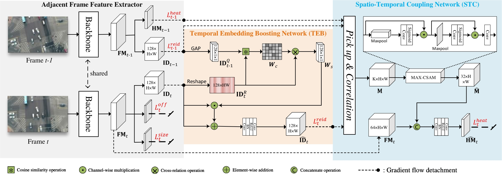

# STCMOT
>[ICME 2024 Oral] STCMOT: Spatio-Temporal Cohesion Learning for UAV-Based Multiple Object Tracking.
</br>
>One-shot multi-class multi-object tracking for UAV videos

## 🚩 Abstract
> Mobject tracking (MOT) in Unmanned Aerial Vehicle (UAV) videos is important 
> for diverse applications in computer vision. Current MOT trackers rely on accurate 
> object detection results and precise matching of target re-identification (ReID). 
> These methods focus on optimizing target spatial attributes while overlooking temporal 
> cues in modelling object relationships, especially for challenging tracking conditions
such as object deformation and blurring, etc. 
> To address the above-mentioned issues, we propose a novel Spatio-Temporal Cohesion 
> Multiple Object Tracking framework (STCMOT), which utilizes historical embedding features 
> to model the representation of ReID and detection features in a sequential order. 
> Concretely, a temporal embedding boosting module is introduced
to enhance the discriminability of individual embedding based on adjacent frame cooperation. 
> While the trajectory embedding is then propagated by a temporal detection refinement module to mine 
> salient target locations in the temporal field. Extensive experiments on the VisDrone2019 and UAVDT datasets 
> demonstrate our STCMOT sets a new state-of-the-art performance in MOTA and IDF1 metrics.

## 🗼 Pipeline of STCMOT



## 💁 Get Started

### Environment preparation

```
git clone https://github.com/ydhcg-BoBo/STCMOT.git
```

```
conda create -n STCMOT
conda activate STCMOT
# Note: GPU 3090 for cuda 11.0
pip install torch==1.7.1+cu110 torchvision==0.8.2+cu110 torchaudio==0.7.2 -f https://download.pytorch.org/whl/torch_stable.htm
cd ${STCMOT_ROOT}
pip install cython
pip install -r requirements.txt
```

* We use [DCNv2_pytorch_1.7](https://github.com/ifzhang/DCNv2/tree/pytorch_1.7) following [FairMOT](http://arxiv.org/abs/2004.01888)
```
git clone -b pytorch_1.7 https://github.com/ifzhang/DCNv2.git
cd DCNv2
./make.sh
```

### Data preparation

* Visdrone [Link!!!](https://github.com/VisDrone/VisDrone-Dataset)

* UAVDT [Link!!!](https://github.com/dataset-ninja/uavdt)


### Train
```
sh experiments/train_stcmot.sh
```


### Test
```
cd src
Run python track.py
```
The multi-object tracking results will be saved as **.txt, and evaluate it by the [official toolkits](https://github.com/VisDrone/VisDrone2018-MOT-toolkit)

### Acknowledgement
A large part of the code is borrowed from [Fairmot](https://github.com/ifzhang/FairMOT) and [MCMOT](https://github.com/CaptainEven/MCMOT).
Thanks for their wonderful works.

### Connection
If you have any questions related to the paper and the code please contact me
